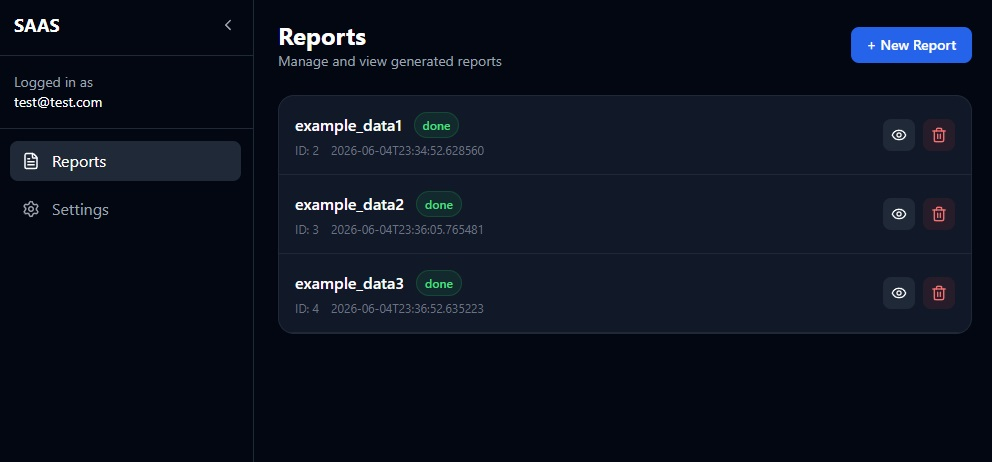
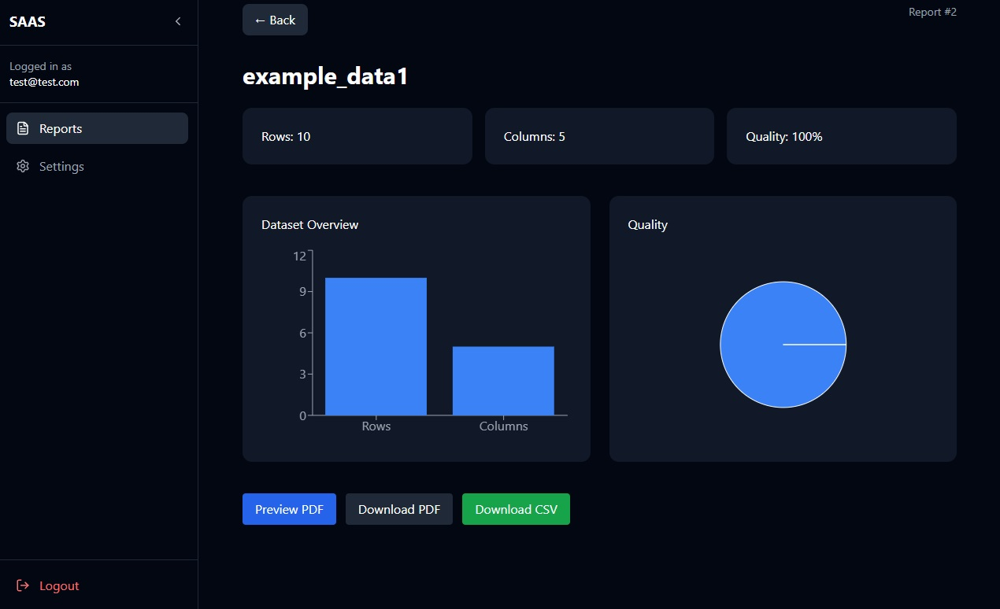
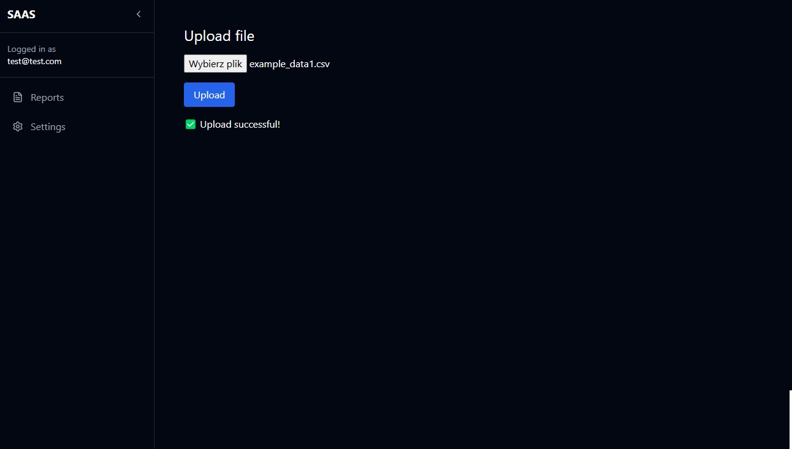
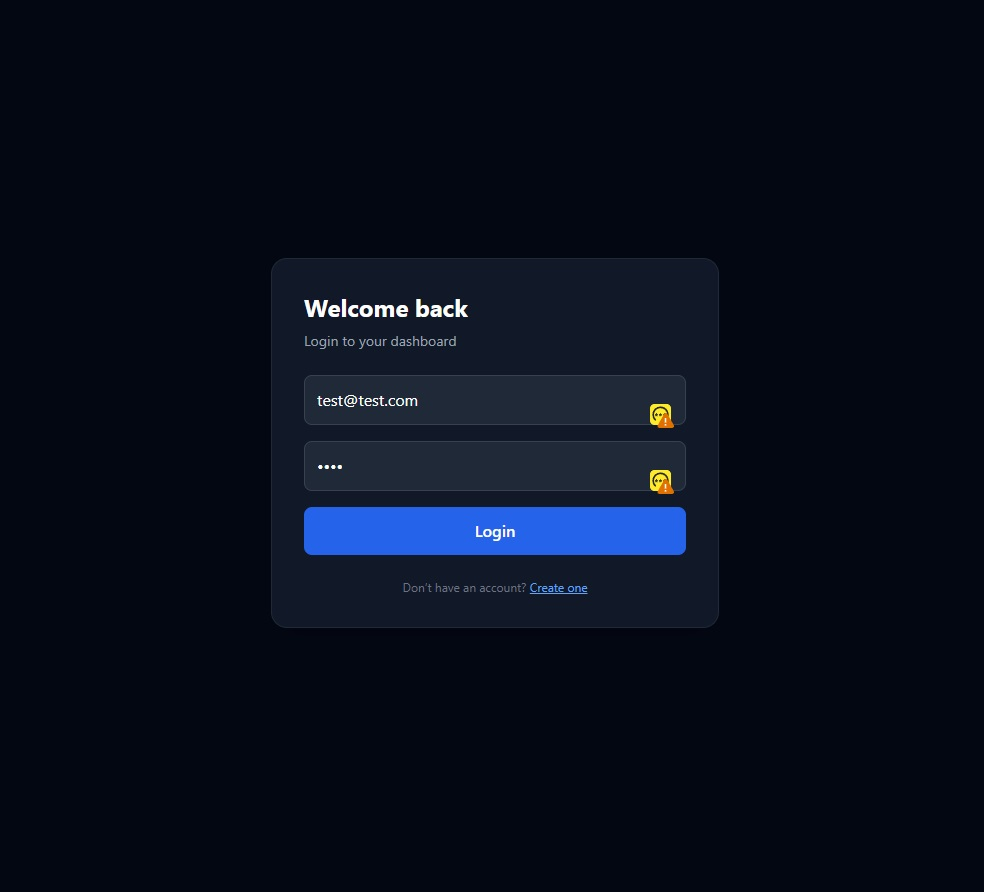

# 🚀 Business Automation Platform

A full-stack web application that automates CSV data processing, report
generation, and business analytics workflows.

Built with FastAPI and React, the platform allows users to upload
datasets, automatically analyze data quality and structure, generate PDF
reports, and manage reports through a secure dashboard.

------------------------------------------------------------------------

## 🔗 Live Demo

Frontend: business-automation-kg917a0ai-themartino.vercel.app/

Backend API:[ https://business-automation-iyqi.onrender.com/ ](https://business-automation-iyqi.onrender.com/)

------------------------------------------------------------------------

## ⚠️ Live Demo Instructions

### 1. Start Backend First

Open backend link

Wait 20--60 seconds for Render to wake up.

You should see a response like: "Backend is running"

------------------------------------------------------------------------

### 2. Start Frontend
Open Fronten link
------------------------------------------------------------------------

### 3. Login

Email: test@test.com

Password: 1234

------------------------------------------------------------------------

### 4. Use Application

-   Upload CSV file
-   View dashboard analytics
-   Generate reports
-   Download PDF / CSV
-   Preview reports

------------------------------------------------------------------------

## 📸 Screenshots

### Dashboard



### Report Details



### Upload Page



### Login


------------------------------------------------------------------------

## ✨ Features

### Authentication

-   JWT authentication
-   Protected routes
-   Secure login system

### Data Processing

-   CSV upload
-   Data analysis
-   Missing values detection
-   Statistics generation

### Reports

-   PDF generation
-   CSV export
-   Report preview
-   Download system

### Dashboard

-   Charts (Recharts)
-   Report management
-   Status tracking
-   Analytics view

## 🚀 CI/CD Pipeline & Docker Setup

### 🐳 Dockerized Backend (FastAPI)

This project uses Docker to containerize the backend built with FastAPI.

The backend is located in the `app/` directory and includes all required dependencies in `requirements.txt`.

### ⚙️ Docker Architecture

The backend container:

- installs dependencies from `requirements.txt`
- copies application code from `/app`
- runs FastAPI with Uvicorn

Example Dockerfile command:

```dockerfile
CMD ["sh", "-c", "uvicorn main:app --host 0.0.0.0 --port ${PORT:-8000}"]
```

---

## ⚡ GitHub Actions CI/CD Pipeline

The project uses **GitHub Actions** for Continuous Integration (CI).

The pipeline automatically runs on every push to the `main` branch.

---

### 🔄 CI Workflow Overview

The CI pipeline performs:

- backend import validation
- automated test execution (pytest)
- frontend build verification (Vite)

---

### 🧪 Backend Tests

Example backend validation step:

```yaml
- name: Backend import test
  run: |
    PYTHONPATH=. python -c "from app.main import app; print('Backend OK')"
```

Or full test run:

```bash
pytest test/ai -v
```

---
## 🚀 Deployment Flow

```
GitHub Push
    ↓
GitHub Actions (CI)
    ├── Backend tests
    ├── Frontend build
    ↓
Render (Backend deploy)
    ↓
Vercel (Frontend deploy)
```

------------------------------------------------------------------------

##  Tech Stack

Frontend: - React - Vite - Tailwind CSS - Recharts - Framer Motion

Backend: - FastAPI - SQLAlchemy - JWT - BackgroundTasks - ReportLab

Database: - PostgreSQL

Deployment: - Vercel (frontend) - Render (backend) - Docker (contenerization)

------------------------------------------------------------------------

## 🧠 Key Highlights

- Dockerized FastAPI backend
- Automated CI pipeline with GitHub Actions
- Separation of backend, frontend, and test layers
- Production-ready deployment on Render & Vercel
- Scalable architecture with test automation
## 🚀 What This Project Demonstrates

-   Full-stack development
-   Authentication system
-   File processing pipelines
-   Background tasks
-   REST API design
-   Data visualization
-   Production deployment
-  Project Contenerization

------------------------------------------------------------------------

## 🔮 Future Improvements

-   User roles (admin/user)
-   Cloud storage integration
-   Email notifications
-   Queue-based processing
-   Advanced analytics

------------------------------------------------------------------------

## 👤 Author

Marcin Witański\
GitHub: https://github.com/MatimoleQQ
